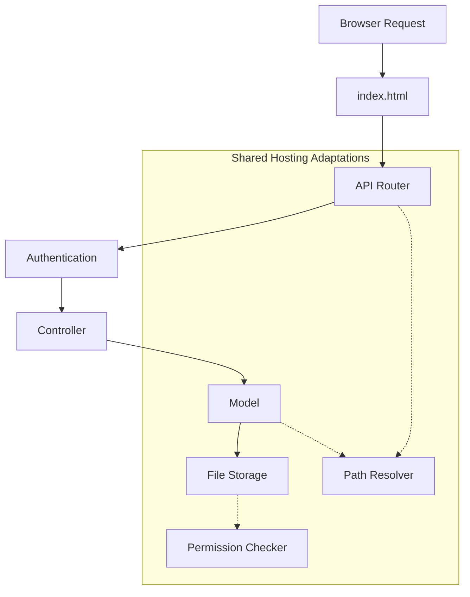
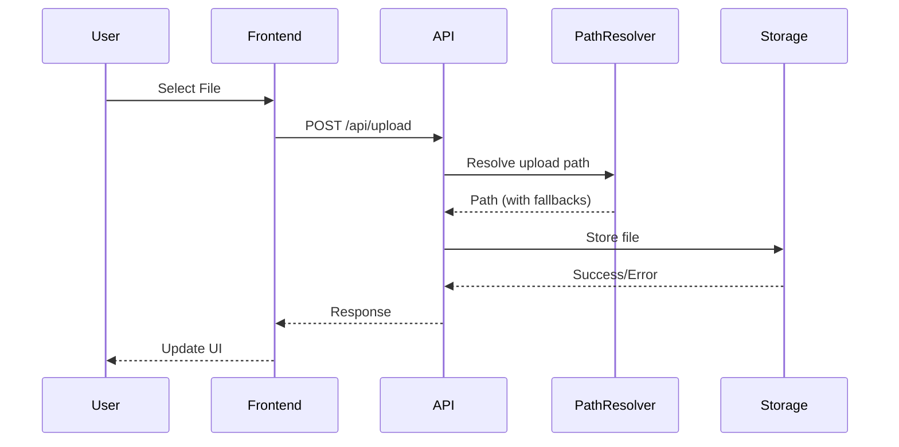

# FileRise Shared Hosting Fork - System Patterns

## Architecture Overview

### Current Architecture (Original FileRise)
```
FileRise/
├── config/
│   └── config.php          # Fixed paths, assumes parent directory access
├── public/                 # Assumed document root
│   ├── index.html         # Frontend entry
│   └── api/               # API endpoints
├── src/
│   ├── controllers/       # Business logic
│   └── models/           # Data models
├── uploads/              # Outside document root (security)
├── users/                # Outside document root (security)
└── metadata/             # Outside document root (security)
```

### Adapted Architecture (Shared Hosting)
```
Option A - Subfolder Install:
public_html/
└── filerise/
    ├── index.html
    ├── api/
    ├── config/
    ├── uploads/
    ├── users/
    └── metadata/

Option B - Root Install:
public_html/
├── index.html
├── api/
├── config/
├── uploads/
├── users/
└── metadata/
```

## Core Design Patterns

### 1. Environment Detection Pattern
```php
class EnvironmentDetector {
    private $strategies = [];
    
    public function detect() {
        foreach ($this->strategies as $strategy) {
            if ($result = $strategy->detect()) {
                return $result;
            }
        }
        return $this->fallbackDetection();
    }
}

// Strategy implementations
class DocumentRootStrategy { /* ... */ }
class OpenBasedirStrategy { /* ... */ }
class ComposerStrategy { /* ... */ }
```

### 2. Path Resolution Pattern
```php
class PathResolver {
    private static $cache = [];
    
    public static function resolve($type) {
        if (isset(self::$cache[$type])) {
            return self::$cache[$type];
        }
        
        $path = match($type) {
            'root' => self::findProjectRoot(),
            'uploads' => self::findUploadsDir(),
            'config' => self::findConfigDir(),
            default => throw new InvalidArgumentException()
        };
        
        self::$cache[$type] = $path;
        return $path;
    }
}
```

### 3. Configuration Cascade Pattern
```php
// Priority order for configuration
1. Environment variables (if available)
2. Local config file (if exists)
3. Auto-detected values
4. Default fallbacks

class ConfigurationManager {
    public function get($key) {
        return $this->getFromEnv($key)
            ?? $this->getFromFile($key)
            ?? $this->getAutoDetected($key)
            ?? $this->getDefault($key);
    }
}
```

## Component Relationships

### Request Flow


### File Storage Pattern
```php
interface StorageAdapter {
    public function store($path, $content);
    public function retrieve($path);
    public function delete($path);
    public function exists($path);
}

class SharedHostingStorage implements StorageAdapter {
    private $basePath;
    private $permissionChecker;
    
    public function store($path, $content) {
        $fullPath = $this->resolvePath($path);
        $this->permissionChecker->ensureWritable($fullPath);
        // Implementation with fallbacks
    }
}
```

## Key Architectural Decisions

### 1. No External Dependencies for Core
- Path detection uses only PHP built-ins
- Fallback mechanisms for every operation
- Graceful degradation over hard failures

### 2. Security in Depth
```php
// Layer 1: .htaccess (if supported)
// Layer 2: PHP-based access control
// Layer 3: Randomized storage paths
// Layer 4: File content validation
```

### 3. Modular Detection System
Each detection mechanism is independent:
- Document root detection
- Upload directory detection
- Permission checking
- Feature availability

### 4. Progressive Enhancement
```javascript
// Frontend adapts to backend capabilities
const features = await api.getAvailableFeatures();
if (features.webdav) {
    showWebDAVOptions();
}
if (features.largeFileUpload) {
    enableResumableUpload();
}
```

## API Design Patterns

### RESTful with Fallbacks
```
Primary: /api/files/{id}
Fallback: /api.php?action=files&id={id}

// Supports both modern and legacy routing
```

### Response Adaptation
```php
class ResponseAdapter {
    public function send($data) {
        if ($this->isJsonSupported()) {
            return $this->jsonResponse($data);
        }
        return $this->legacyResponse($data);
    }
}
```

## Error Handling Strategy

### Shared Hosting Specific Errors
```php
class SharedHostingException extends Exception {
    public function getUserMessage() {
        return match($this->getCode()) {
            1001 => "Cannot access directory (open_basedir restriction)",
            1002 => "Permission denied - contact your hosting provider",
            1003 => "Feature not available on shared hosting",
            default => "An error occurred"
        };
    }
}
```

### Diagnostic Mode
```php
// Special mode for troubleshooting
if (isset($_GET['diagnose'])) {
    $diagnostics = new HostingDiagnostics();
    $diagnostics->runChecks();
    $diagnostics->suggestSolutions();
}
```

## Data Flow Patterns

### User Upload Flow


## Migration Patterns

### From Original to Shared Hosting
```php
class MigrationAssistant {
    public function analyze() {
        return [
            'current_structure' => $this->detectCurrentStructure(),
            'recommended_structure' => $this->recommendStructure(),
            'required_actions' => $this->calculateMigrationSteps()
        ];
    }
    
    public function migrate() {
        // Safe, step-by-step migration
        // with rollback capability
    }
}
``` 